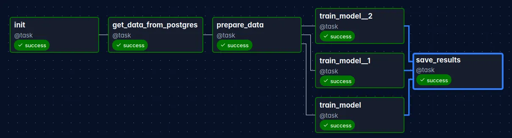
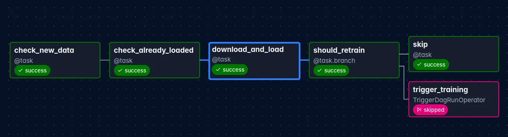

# NYC Taxi Duration Predictor

MLOps пет-проект: автоматизированный пайплайн сбора данных, обучения моделей и инференса на данных NYC Yellow Taxi.

## Что делает проект

Проект предсказывает **длительность поездки на такси в Нью-Йорке** в минутах на основе параметров поездки: откуда, куда, время суток, расстояние, стоимость.

### Как идут данные
```
NYC TLC сайт (parquet файлы)
        ↓
fill_db.py — разовая начальная загрузка
        ↓
PostgreSQL — хранение всех поездок
        ↓
nyc_taxi_ingest DAG — ежемесячно проверяет новые данные,
                      заливает в PostgreSQL, триггерит обучение
        ↓
nyc_taxi_train DAG — обучает 3 модели параллельно,
                     выбирает лучшую, сохраняет в S3
        ↓
Yandex Cloud S3 — хранит модели (.pkl) и метрики (.json)
        ↓
FastAPI — загружает модель из S3, отдаёт предсказания
```

## Стек

- **Apache Airflow 3** — оркестрация пайплайнов
- **PostgreSQL** — хранение данных о поездках
- **Yandex Cloud Object Storage (S3)** — хранение моделей и метрик
- **scikit-learn** — обучение моделей
- **FastAPI** — REST API для инференса
- **Docker** — контейнеризация PostgreSQL и API

## DAG: nyc_taxi_train



Запускается вручную или по триггеру от `nyc_taxi_ingest`. Обучает три модели параллельно и сохраняет лучшую.

**Таски:**

`init` — логирует старт пайплайна.

`get_data_from_postgres` — подключается к PostgreSQL через `pg_connection`, делает выборку 100 000 случайных строк из таблицы `taxi_trips`, сериализует в pickle и загружает в S3 по пути `datasets/taxi_trips.pkl`.

`prepare_data` — скачивает датасет из S3, разделяет на train/test (80/20), нормализует фичи через `StandardScaler`. Сохраняет в S3 четыре файла: `X_train.pkl`, `X_test.pkl`, `y_train.pkl`, `y_test.pkl`. Скейлер сохраняется отдельно как `models/scaler.pkl` — он нужен FastAPI для нормализации входных данных при инференсе.

`train_model`, `train_model__1`, `train_model__2` — три таска запускаются **параллельно**, каждый обучает свою модель: `RandomForestRegressor`, `GradientBoostingRegressor`, `LinearRegression`. Каждый таск скачивает подготовленные данные из S3, обучает модель, считает метрики (R², RMSE, MAE), сохраняет модель в S3 и возвращает метрики через **XCom**.

`save_results` — получает метрики всех трёх моделей из XCom, выбирает лучшую по R², копирует её в S3 как `models/best_model.pkl`. Сохраняет все метрики в `results/{дата}.json`.

## DAG: nyc_taxi_ingest



Запускается автоматически 1-го числа каждого месяца. Проверяет появились ли новые данные на сайте NYC TLC и при необходимости запускает переобучение.

**Таски:**

`check_new_data` — делает HEAD запрос к сайту NYC TLC, ищет последний доступный месяц (перебирает от текущего назад). Если файл доступен — возвращает `{"year": ..., "month": ...}`, иначе `None`.

`check_already_loaded` — проверяет в PostgreSQL есть ли уже строки с этим `year` и `month`. Если данные уже загружены — возвращает `None` чтобы не дублировать. Это защита от повторного запуска.

`download_and_load` — если период не `None` — скачивает parquet файл с NYC TLC, делает feature engineering (длительность поездки, час, день недели, признак выходного), фильтрует выбросы, заливает в PostgreSQL. Возвращает `True` если данные залиты.

`should_retrain` — ветвление (`@task.branch`): если данные залиты (`True`) — направляет в `trigger_training`, иначе в `skip`.

`trigger_training` — триггерит DAG `nyc_taxi_train` через `TriggerDagRunOperator`. Переобучение запускается автоматически на свежих данных.

`skip` — логирует что новых данных нет, ничего не делает.

## Быстрый старт

### 1. Клонировать репозиторий
```bash
git clone https://github.com/grigory222/nyc-taxi-mlops
cd nyc-taxi-mlops
```

### 2. Создать .env файл
```bash
cp .env.example .env
# заполнить своими значениями
```

### 3. Поднять PostgreSQL
```bash
docker compose up postgres -d
```

### 4. Залить начальные данные
```bash
conda activate nyc_taxi_env
python fill_db.py
```

Скрипт автоматически найдёт последний доступный месяц на сайте NYC TLC и загрузит его.

### 5. Запустить Airflow
```bash
export AIRFLOW_HOME=$(pwd)/airflow
airflow standalone
```

Открыть http://localhost:8080, добавить connections:

**pg_connection** (тип Postgres):
- Host: `localhost`
- Database: `airflow_db`
- Login: `airflow_user`
- Password: `airflow_pass`
- Port: `5432`

**s3_connection** (тип Amazon Web Services):
- AWS Access Key ID: ваш ключ
- AWS Secret Access Key: ваш секрет
- Extra: `{"endpoint_url": "https://storage.yandexcloud.net", "region_name": "ru-central1"}`

Запустить DAG `nyc_taxi_train` вручную через Trigger.

### 6. Запустить API
```bash
docker compose up api -d
```

Или локально:
```bash
uvicorn api.main:app --reload
```

## API

### Предсказание длительности поездки
```bash
curl -X POST http://localhost:8000/predict \
  -H "Content-Type: application/json" \
  -d '{
    "passenger_count": 2,
    "trip_distance": 3.5,
    "PULocationID": 161,
    "DOLocationID": 237,
    "fare_amount": 14.5,
    "pickup_hour": 18,
    "pickup_dayofweek": 2,
    "is_weekend": 0
  }'
```

Ответ:
```json
{"duration_min": 12.87, "model": "random_forest"}
```

### Эндпоинты

- `POST /predict` — предсказание длительности поездки
- `GET /health` — статус сервиса и состояние модели
- `GET /model/info` — название модели и метрики последнего обучения
- `GET /docs` — Swagger UI

## Структура проекта
```
nyc-taxi-mlops/
├── api/
│   ├── main.py         # FastAPI роуты
│   ├── model.py        # загрузка модели из S3, инференс
│   ├── schemas.py      # Pydantic схемы запросов и ответов
│   └── config.py       # настройки из .env
├── airflow/
│   └── dags/
│       ├── train_dag.py   # DAG обучения моделей
│       └── ingest_dag.py  # DAG загрузки новых данных
├── docs/
│   ├── train_dag.png
│   └── ingest_dag.png
├── fill_db.py          # начальная загрузка данных
├── docker-compose.yml
├── Dockerfile
├── requirements-api.txt
├── .env.example
└── README.md
```
